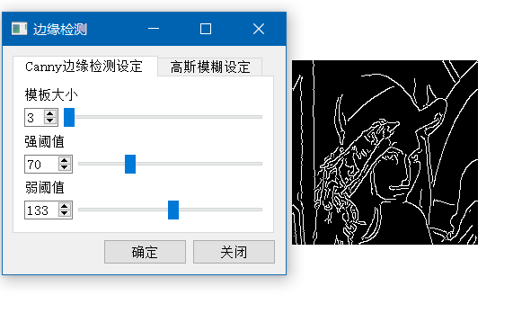

<!-- 顺手学习markdown -->

<h1> 图像视频处理GUI</h1>

- [下载](#%E4%B8%8B%E8%BD%BD)
- [环境](#%E7%8E%AF%E5%A2%83)
- [注意](#%E6%B3%A8%E6%84%8F)
- [功能说明](#%E5%8A%9F%E8%83%BD%E8%AF%B4%E6%98%8E)
- [**部分**功能演示](#%E9%83%A8%E5%88%86%E5%8A%9F%E8%83%BD%E6%BC%94%E7%A4%BA)

## 下载

## 环境
  | 组件      | 版本   | 环境  |
  | --------- | -----: | :---: |
  | *Qt*      | 5.9.4  | 32bit |
  | *Qtchart* | 5.9.4  | 32bit |
  | *Opencv*  | 2.4.10 | 32bit |

## 注意

该项目只是一个图像视频处理的演示程序,也是重邮数字媒体实验课的一次作业。  
由于该软件基于opencv,不会对视频帧进行压缩，所以视频不要过大

## 功能说明
- 已经实现的功能如下:
  - **图像**
    1. 二值化、灰度化
    2. 灰度变换，包括线性变换、线性分段变换、对数变换、幂率变换
    3. 直方图均衡化
    4. 颜色空间缩减
    5. 空间滤波，包括均值滤波、高斯滤波、中值滤波、拉普拉斯滤波
    6. 频域滤波，包括理想滤波、高斯滤波、巴特沃斯滤波
    7. DCT 离散余弦变换
    8. 基于 canny 算子的边缘检测算法
  - **视频**
    1. 二值化、灰度化
    2. 直方图均衡化
    3. 颜色空间缩减
    4. 空间滤波，包括均值滤波、高斯滤波、中值滤波、拉普拉斯滤波
    5. 基于 canny 算子的边缘检测算法

## **部分**功能演示
- **图像处理**
  - 二值化  
    
  - 灰度变换  
    
  - 直方图均衡化  
    
  - 颜色空间缩减  
    
  - 滤波
    - 空间滤波  
      
    - 频域滤波  
      
  - DCT 离散余弦变换  
    
  - canny 边缘检测  
    
- **视频处理**
  - 灰度化  
    
  - 拉普拉斯滤波  
    
  - 边缘检测  
    
